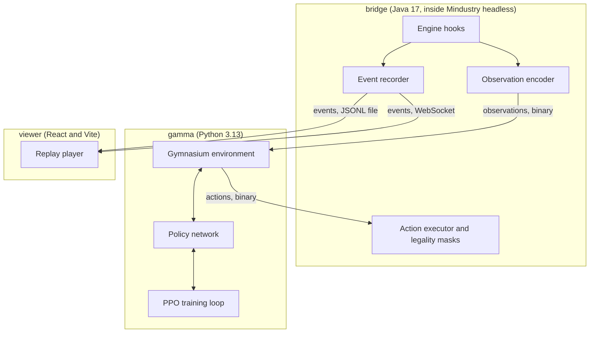

# Architecture

How `mindustry-ai` is put together, and why. This document is the reference for every
implementation decision in the repository. Individual decisions, with the alternatives
that were rejected, live in [`docs/decisions/`](decisions/).

## Contents

- [Design constraints](#design-constraints)
- [System overview](#system-overview)
- [The bridge](#the-bridge)
- [Observation space](#observation-space)
- [Action space](#action-space)
- [Reward and curriculum](#reward-and-curriculum)
- [Replay format](#replay-format)
- [Training](#training)
- [Viewer](#viewer)
- [Throughput budget](#throughput-budget)
- [Open questions](#open-questions)

## Design constraints

These are properties of Mindustry, not choices. Everything downstream bends around them.

| Constraint | Consequence |
|---|---|
| The engine is not thread safe | Parallelism means many JVM processes, never many threads inside one. |
| Simulation is expensive | Thousands of blocks and item movements per tick. Cost scales with how much factory exists, so a developed base is far slower than an empty map. |
| Mindustry is GPL-3.0 | Anything linking against the engine is GPL-3.0, including this project. |
| No observation API exists | The bridge has to expose state the game was never designed to expose. |
| Rewards arrive late | A smelter pays off minutes after the decision to build it. Credit assignment is the hard part. |

## System overview

Three processes, deliberately separated by language boundary and by lifecycle.

The separation is not cosmetic. The bridge must live inside the JVM because Mindustry
state is only reachable from the engine thread. Training must live in Python because that
is where the machine learning ecosystem is. The viewer must run with neither of them
alive, because a replay should still be watchable months later from a static file.

## The bridge

A JVM mod loaded into the Mindustry headless server. It has exactly three jobs.

**Expose state.** Each step it encodes the world into the observation tensors described
below. It runs on the engine thread, so it never needs a lock.

**Execute actions and compute legality.** It receives an action, validates it, applies it
through the engine build path, and returns the legality masks for the next step. Those
masks are the bridge's most valuable output: only the engine knows whether a tile is
buildable, whether resources cover a cost, and whether a block is unlocked.

**Record events.** It appends to the event log that both replay files and the live
WebSocket feed are built from.

The bridge deliberately contains **no strategy**. It never decides what a good move is.
Anything resembling judgment belongs in Python, where it can be learned instead of
hardcoded.

## Observation space

Two parts, because Mindustry state is two-natured.

**Spatial tensor**, shape `(C, H, W)`, one entry per map tile:

| Channel group | Content |
|---|---|
| Terrain | passable, wall, deep liquid |
| Ore | one channel per ore type present on the map |
| Blocks | block category, ownership (self, enemy, neutral), health fraction |
| Power | connected to a grid, grid satisfaction |
| Units | friendly and hostile unit density |
| Threat | turret coverage, both sides |
| Buildability | whether a tile currently accepts construction |

**Global vector**, everything that has no location: resources held per item type,
production rate per item type, current wave and time until the next one, unlocked
technology, unit counts by type, core health.

Map size varies, so the spatial tensor is padded to a fixed size per curriculum stage,
with a validity channel marking real tiles. Network shape stays constant while the
curriculum grows maps from 32x32 to full size.

## Action space

**The agent can perform every action a human player can.** This is the central
requirement, and it drives everything else in this section.

Expressed naively, that is roughly 200 block types times up to 500x500 positions times
rotation and configuration: on the order of 10^8 discrete choices. No policy learns over
a flat space that size.

The fix is to factor one action into dependent components, each with its own network head,
sampled autoregressively. This is the approach AlphaStar uses for StarCraft II.

| Head | Size | Notes |
|---|---|---|
| `type` | ~12 | place, break, configure, command units, control avatar, invoke macro, no-op |
| `block` | ~200 | full catalogue, masked to unlocked and affordable |
| `position` | H x W | spatial head, a probability map from the convolutional trunk |
| `rotation` | 4 | conveyor and conduit orientation |
| `config` | contextual | sorter item, unloader item, and similar |
| `macro` | library size | index into the scripted macro library |

Expressiveness is unchanged. Learnability is transformed: the policy makes a handful of
small decisions instead of one impossible one.

### Legality masking

Every head is masked to legal choices before sampling. On a real map, the tiles where a
mechanical drill can legally be placed number in the hundreds, not the tens of thousands.
Masking collapses the effective space without removing a single capability.

This is not a heuristic. [Gym-uRTS](https://arxiv.org/abs/2105.13807) shows that invalid
action masking is the decisive factor for learning in a grid RTS: without it training
fails outright, with it the same problem converges on a single GPU. Masks are computed by
the bridge, because only the engine knows ground truth.

### Macros as options, not as walls

A library of scripted routines (route a conveyor from A to B, place a drill on the richest
reachable ore patch, wall off an approach) is exposed as **one additional action type**.
The agent may invoke a macro, or may place every block itself. It chooses.

This buys three things:

- Early reward, because macros produce competent behaviour before the policy is any good.
- No ceiling, because nothing stops the agent from ignoring macros and inventing better.
- The scripted baseline (Alpha) for free, since a fixed macro sequence is exactly that.

It also produces a measurement worth watching: **macro usage rate over training**. When
that curve falls, the agent has found something better than the human strategies it was
handed. That transition is the most interesting single result this project can produce.

## Reward and curriculum

The curriculum grows along two axes at once: task difficulty and map size.

| Stage | Task | Map | What it validates |
|---|---|---|---|
| T1 | Deliver 100 copper to the core | 32x32 | The bridge works end to end. |
| T2 | Sustain two ore types into the core | 32x32 | Multi-chain routing. |
| T3 | Build a working graphite chain | 64x64 | Refinement, power, longer horizons. |
| T4 | Survive 5 waves | 64x64 | Defence enters the picture. |
| T5 | Survive 20 waves | full | Economy and defence together. |
| T6 | Full survival game, maximise waves | full | The real game. |
| T7 | Attack, destroy enemy cores | full | Offence. |
| T8 | PvP self-play | full | The endgame. |

Each stage is a benchmark with a number attached, runnable in seconds, comparable across
agents. That is what makes debugging possible: when a run fails, the last passing stage
says which component broke.

Reward is deliberately thin: task completion, a time bonus, and a small dense term on
resource throughput. Heavy shaping teaches an agent to farm the shaping rather than to
play, and the macro library already supplies the early guidance that shaping is usually
there to provide.

## Replay format

One format, two transports.

An append-only event log. A header carries the map, the rules and the initial terrain.
Every line after that is a delta: a block placed, a block destroyed, a unit spawned, a
wave started, resources changed.

Written to disk it is gzipped JSON Lines, which compresses heavily because the content is
repetitive, and which streams line by line. Pushed over a WebSocket it is the same lines
in the same order. **The viewer cannot tell the difference**, so live viewing costs almost
nothing once replay works. The reverse would have meant writing everything twice.

Replays are the primary artefact of this project. A reward curve tells you training is
progressing. A replay tells you what the agent actually did.

## Training

PPO, implemented in this repository rather than pulled from a library.

Stable-Baselines3 has no clean support for factored action spaces with per-head masking,
which is the one thing this project cannot compromise on. The reference implementation to
follow is the CleanRL Gym-uRTS agent, which solves exactly this shape of problem in a
single readable file. SB3 is kept only as a smoke test against a simplified flat action
space, to tell a broken environment apart from a weak agent.

Network: a convolutional trunk over the spatial tensor, concatenated with an encoding of
the global vector, feeding the autoregressive action heads and a value head.

Parallelism is process-level. Each environment is its own Mindustry JVM, because the
engine forbids anything else.

## Viewer

Vite, React, TypeScript, Canvas 2D. No backend for playback: the viewer reads event log
files directly, so it deploys to GitHub Pages as static files.

That is what makes **replays playable from the README in one click**, with nothing to
install. For an open project this matters more than any metrics dashboard. It is the
difference between telling people the agent learned something and showing them.

Screens: a replay player with a scrubbable timeline, a generation gallery sorted by score,
a side-by-side comparator for two runs, and live training metrics.

## Throughput budget

Measured, not estimated. Full results and caveats in
[`measurements/throughput.md`](measurements/throughput.md).

On a Ryzen 9 9950X3D with 93 GB of RAM, one accelerated instance reaches **592x realtime**,
and 24 concurrent instances reach **4,806x aggregate**, which is roughly 8 full ten-minute
matches per wall-clock second. That is an order of magnitude better than this design
assumed, and it means simulation speed is not the binding constraint on the curriculum.

Two caveats keep that figure honest: it was measured on an almost empty map, and with no
agent in the loop. A developed factory and a policy network will both take their cut.

## Open questions

Unresolved, recorded here so they are not silently forgotten.

- **Reset cost.** Whether a fresh map load is cheap enough per episode, or whether state
  must be snapshotted and restored in memory instead.
- **Determinism.** How reproducible a Mindustry run is given identical seeds and actions.
  This decides whether replays can be stored as action sequences instead of event logs. The
  fixed timestep from decision 6 removes one source of divergence, but the rest is untested.
- **MindustryX.** The [MindustryX](https://github.com/TinyLake/MindustryX) fork advertises
  a local AI bridge. Worth evaluating before writing ours from scratch.
- **Observation channel count.** The list above is a starting point, not a measurement.
  Channels carrying no signal are cost without benefit.
